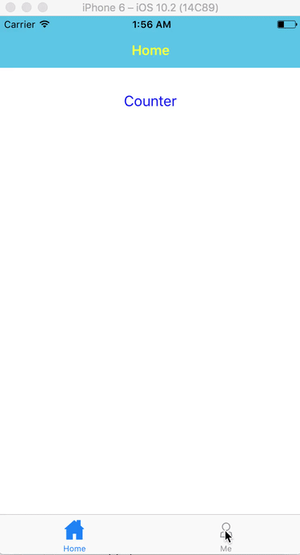

This repo shows how to build a react native starter kit step by step.

All starter kits in this tutorial use ES6 by default.

Table of Contents
-----------------
1. [Step1: Create an Empty Project](#1-step1-create-an-empty-project)
1. [Step2: Step1 + MobX](#2-step2-step1--mobx)
1. [Step3: Use Provider and Inject to Avoid Singleton](#3-step3-use-provider-and-inject-to-avoid-singleton)
1. [Step4: Step3 + Bottom Tab Bar](#4-step4-step3--bottom-tab-bar)


# 1 Step1: Create an Empty Project

First install all dependencies according to the official document, [Getting Started](https://facebook.github.io/react-native/docs/getting-started.html)

Let's create an empty project,

    react-native init Step1


Then run it in the iOS simulator,

    cd Step1
    react-native run-ios


# 2 Step2: Step1 + MobX

In this section we're going to build the classical `Counter` component using MobX.

Install MobX,

    npm install --save mobx mobx-react

We need to install the `babel-plugin-transform-decorators-legacy` Babel plugin to use ES7 decorator,

    npm install --save-dev babel-plugin-transform-decorators-legacy

Don't forget to enable it in `.babelrc`,

```json
{
  "presets": ["react-native"],
  "plugins": ["transform-decorators-legacy"]
}
```

In the root directory, create a folder named `app`. In `app`, create a folder named `store`. In `store`, create a file named `counter.js`,

```javascript
// @flow
import {observable, action, useStrict} from 'mobx'
useStrict(true)

class CounterStore {
  @observable counter = 0;

  @action increment() {
    this.counter++;
  }

  @action decrement() {
    this.counter--;
  }

  @action incrementAsync() {
    setTimeout(() => {
      this.increment();
    }, 1000);
  }
}

export default new CounterStore();
```

Create a component, `app/components/Counter.js`,

```jsx
// @flow
import { observer } from 'mobx-react/native';

import React, { Component, PropTypes } from 'react';
import {
  StyleSheet,
  Text,
  TouchableHighlight,
  View
} from 'react-native';

const styles = StyleSheet.create({
  container: {
    flex: 1,
    justifyContent: 'center',
    alignItems: 'center',
    backgroundColor: '#F5FCFF'
  },
  text: {
    fontSize: 20,
    textAlign: 'center',
    margin: 10
  },
  heading: {
    fontSize: 30,
    textAlign: 'center',
    margin: 10
  }
});

function Counter(props) {
  return (
    <View style={styles.container}>
      <Text style={styles.heading}>Mobx Counter</Text>
      <TouchableHighlight onPress={() => props.store.increment()}>
        <Text style={styles.text}>|   +   | </Text>
      </TouchableHighlight>

      <Text style={styles.text}>Clicked: {props.store.counter} times</Text>

      <TouchableHighlight onPress={() => props.store.decrement()}>
        <Text style={styles.text}>|   -   | </Text>
      </TouchableHighlight>

      <TouchableHighlight onPress={() => props.store.incrementAsync()}>
        <Text style={styles.text}>|   + Async   | </Text>
      </TouchableHighlight>
    </View>
  );
}
Counter.propTypes = {
  store: PropTypes.object.isRequired
};

export default observer(Counter);
```

Change the content of `index.ios.js` and `index.android.js` to the following:

```jsx
// @flow
import React, { Component } from 'react';
import { AppRegistry } from 'react-native';
import Counter from './app/components/Counter';
import counterStore from './app/store/counter';

export default class Step2 extends Component {
  render() {
    return (
      <Counter store={counterStore}/>
    );
  }
}

AppRegistry.registerComponent('Step2', () => Step2);
```

References:

* [React Native + Mobx List App - Github](https://github.com/dabit3/react-native-mobx-list-app)
* [React Native with MobX — Getting Started](https://medium.com/react-native-training/react-native-with-mobx-getting-started-ba7e18d8ff44#.hkfdy2fgl)
* [mobx-react-native-counter](https://github.com/bartonhammond/mobx-react-native-counter)


# 3 Step3: Use Provider and Inject to Avoid Singleton

In previous section we created a singleton using `export default new CounterStore();`, and import it where needed. If the number of stores grows, it would become clumpsy, the author of MobX recommends using `Provider`, see <https://github.com/mobxjs/mobx/issues/300>.

In `app/store/counter.js` exports a class instead of an instance, and create a root store in `src/store/index.js`,

```javascript
import CounterStore from './counter';

// root store
const rootStore = {
  "counter": new CounterStore()
};
export default rootStore;
```

Only inject the store that is needed by a component, for example, inject the `counter` store to the `Counter` component,

```javascript
export default inject("counter")(observer(Counter));
```

Use `Provider` in the root component, in this case it is the `Step2` component in `index.ios.js` and `index.android.js`.

See [this commit](https://github.com/soulmachine/react-native-starter-kit/commit/6c0a483054774559bfd87c12de8cebd87541f7c8) for details.

References:

* [How to use Provider and inject in MobX](https://gist.github.com/sonaye/8756d1077942b0144767d3de0ded9b16)


# 4 Step4: Step3 + Bottom Tab Bar

In this section we're going to add a tabbar at the bottom, see the demo:



Make sure you are using react-native version 0.37.0 and react 15.3.2, to achive this you just need to init the project with the following:

    react-native init Step4 --version react-native@0.38.0

We will use [react-native-navigation](https://github.com/wix/react-native-navigation) to implement the bottom tab bar.

    npm install react-native-navigation@next --save

And then run `react-native link` to link your libraries that contain native code.

Add the `RCTAnimation` library to this project:

1. Open `ios/Step4.xcodeproj` with Xcode, in Project Navigator (left pane), right-click on the `Libraries` and select  `Add files to [project name]`. Add `./node_modules/react-native/Libraries/NativeAnimation/RCTAnimation.xcodeproj.xcodeproj`.
1. In Project Navigator (left pane), click on your project (top) and select the `Build Phases` tab (right pane). In the `Link Binary With Libraries` section add `libRTCAnimation.a`.


Use this file [AppDelegate.m](https://github.com/wix/react-native-navigation/blob/master/example/ios/example/AppDelegate.m) to overwrite `ios/Step4/AppDelegate.m`.

Change the file `android/app/src/main/java/com/step4/MainActivity.java` to the following:

```java
package com.step4;

import com.reactnativenavigation.controllers.SplashActivity;

public class MainActivity extends SplashActivity {

}
```

And change `android/app/src/main/java/com/step4/MainApplication.java` to the following:

```java
package com.step4;

import android.support.annotation.Nullable;

import com.facebook.react.ReactPackage;
import com.reactnativenavigation.NavigationApplication;

import java.util.List;

public class MainApplication extends NavigationApplication {
    @Override
    public boolean isDebug() {
        return BuildConfig.DEBUG;
    }

    @Nullable
    @Override
    public List<ReactPackage> createAdditionalReactPackages() {
        return null;
    }
}
```

Create a folder `app/screens` and put several screens here.

Change `index.ios.js` and `index.android.js` to the following:

```javascript
// @flow
import {Navigation} from 'react-native-navigation';

// screen related book keeping
import {registerScreens} from './app/screens/register_screens';
registerScreens();

const tabs = [
  {
    label: 'Home',
    screen: 'Home', // this is a registered name for a screen
    icon: require('./images/home.png'),
    selectedIcon: require('./images/home_selected.png'),
    title: 'Home'
  },
  {
    label: 'Me',
    screen: 'Me', // this is a registered name for a screen
    icon: require('./images/profile.png'),
    selectedIcon: require('./images/profile_selected.png'),
    title: 'Me',
    navigatorStyle: {
      tabBarBackgroundColor: '#4dbce9',
    }
  }
];

// this will start our app
Navigation.startTabBasedApp({
  tabs: tabs,
  appStyle: {
    tabBarBackgroundColor: '#0f2362',
    tabBarButtonColor: '#ffffff',
    tabBarSelectedButtonColor: '#63d7cc'
  }
});
```

References:

* [Usage](https://github.com/wix/react-native-navigation/wiki/Usage)
* [example](https://github.com/wix/react-native-navigation/tree/master/example)
